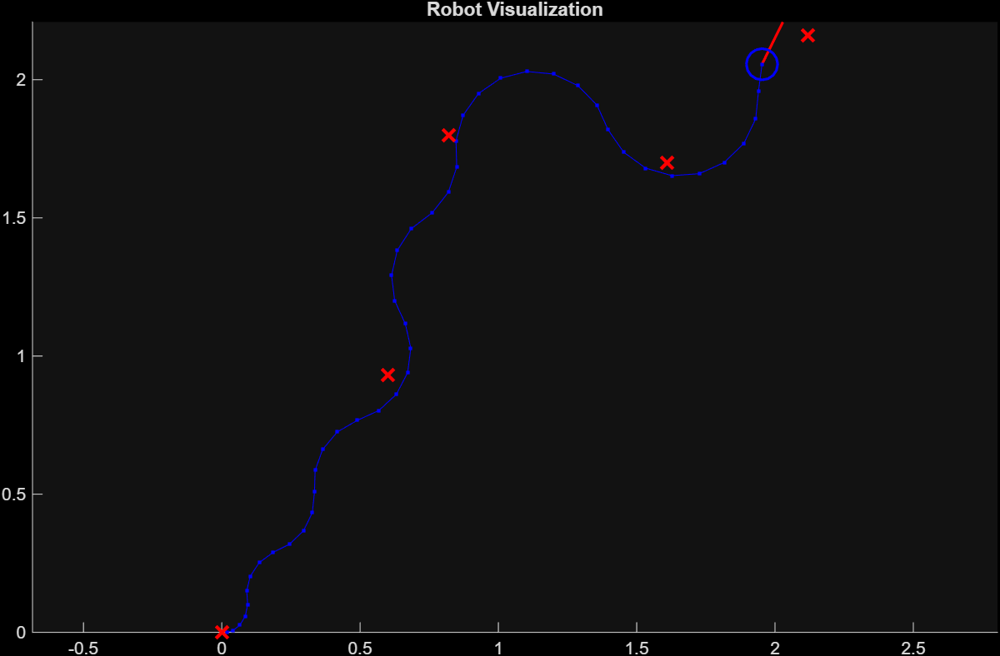

# Differential Drive Waypoint Navigation

Autonomous waypoint tracking system for differential drive robots using **Pure Pursuit** path following with **PID velocity control** and **inverse kinematics**, implemented in MATLAB/Simulink.



## Control Architecture

```
                                        Velocity Feedback [v, ω]
                                    ┌───────────────────────────────────────┐
                                    │                                       │
┌─────────────┐    ┌──────────────┐ │  ┌─────────┐    ┌───────────────────┐ │  ┌─────────────────────┐
│  Waypoints  │───▶│ Pure Pursuit │─┴─▶│   PID   │───▶│ Inverse Kinematics│─┴─▶│ Differential Drive  │
│   [x, y]    │    │  Controller  │    │ Control │    │   (v,ω) → (vl,vr) │    │   Forward Model     │
└─────────────┘    └──────────────┘    └─────────┘    └───────────────────┘    └─────────────────────┘
                          ▲                                                              │
                          │                    Pose Feedback [x, y, θ]                   │
                          └──────────────────────────────────────────────────────────────┘
```

**Dual Feedback Loops:**
1. **Outer Loop (Pose)**: Pure Pursuit receives [x, y, θ] to compute desired velocities
2. **Inner Loop (Velocity)**: PID controllers receive [v, ω] error for velocity tracking

## Features

- **Pure Pursuit Algorithm**: Geometric path tracking that computes linear and angular velocities to follow waypoints smoothly
- **Dual PID Controllers**: Separate discrete PID(z) controllers for linear and angular velocity tracking
- **Velocity Feedback (Transformation)**: Computes actual [v, ω] from wheel speeds for closed-loop PID control
- **Inverse Kinematics**: Converts body velocities (v, ω) to individual wheel speeds (vl, vr)
- **Differential Drive Model**: Forward kinematics simulation with pose integration
- **Goal Detection**: Euclidean distance-based waypoint arrival detection (threshold: 0.25m)
- **Zero-Velocity Stop**: Automatic velocity zeroing when goal is reached
- **Real-time Visualization**: Live robot pose and trajectory plotting

## System Block Diagram

| Subsystem | Function |
|-----------|----------|
| **Pure Pursuit** | Computes desired linear/angular velocities based on current pose and waypoints |
| **PID(z) Controllers** | Discrete-time velocity tracking with error feedback from Transformation block |
| **Zero-Velocity At Goal** | Multiplexer that zeros output when `atGoal` flag is true |
| **Inverse Kinematics** | `vl = v - (L/2)ω`, `vr = v + (L/2)ω` |
| **Transformation** | Velocity feedback: `v = (vl+vr)/2`, `ω = (vr-vl)/L` |
| **Differential Drive System** | Forward kinematics with pose integration: x, y, θ |
| **Check Distance To Goal** | `√((x-xg)² + (y-yg)²) > threshold` |

## Robot Parameters

| Parameter | Symbol | Value | Unit |
|-----------|--------|-------|------|
| Wheel Radius | R | 0.05663 | m |
| Wheel Base (Track Width) | L | 0.40 | m |
| Sample Time | dt | 0.05 | s |

## Waypoints Configuration

Default waypoints (can be modified in the Simulink model):
```matlab
waypoints = [0,    0;      % Start position
             0.60, 0.93;   % Waypoint 1
             0.82, 1.80;   % Waypoint 2
             1.61, 1.70;   % Waypoint 3
             2.12, 2.16];  % Goal position
```

## Getting Started

### Prerequisites
- MATLAB R2020a or later
- Simulink
- Robotics System Toolbox (for Pure Pursuit block)

### Installation

1. Clone the repository:
```bash
git clone https://github.com/Seeker002/differential-drive-waypoint-navigation.git
cd differential-drive-waypoint-navigation
```

2. Open MATLAB and navigate to the project directory

3. Load robot parameters:
```matlab
run('scripts/DiffDriveValue.m')
```

4. Open and run the Simulink model:
```matlab
open_system('waypoint_navigation.slx')
sim('waypoint_navigation')
```

## Project Structure

```
differential-drive-waypoint-navigation/
├── images/
│   └── trajectory.png          # Simulation result showing robot path
├── scripts/
│   └── DiffDriveValue.m        # Robot physical parameters
├── waypoint_navigation.slx     # Main Simulink model
├── LICENSE
└── README.md
```

## Mathematical Background

### Differential Drive Kinematics

**Forward Kinematics** (wheel speeds → body velocity):
```
v = (vl + vr) / 2          # Linear velocity
ω = (vr - vl) / L          # Angular velocity
```

**Inverse Kinematics** (body velocity → wheel speeds):
```
vl = v - (L/2) * ω         # Left wheel velocity
vr = v + (L/2) * ω         # Right wheel velocity
```

**Pose Update** (discrete integration):
```
x(k+1) = x(k) + v * cos(θ) * dt
y(k+1) = y(k) + v * sin(θ) * dt
θ(k+1) = θ(k) + ω * dt
```

### Pure Pursuit Algorithm

The Pure Pursuit controller computes steering commands by:
1. Finding a look-ahead point on the path
2. Computing the curvature to reach that point
3. Generating linear and angular velocity commands

## Results

The trajectory plot shows the robot successfully navigating through all waypoints:
- **Blue dots**: Robot trajectory
- **Red X markers**: Waypoint locations
- **Blue circle**: Current robot position
- **Red line**: Robot heading direction

## Customization

### Modifying Waypoints
Edit the `Waypoints1` constant block in the Simulink model with your desired [x, y] coordinates.

### Tuning PID Controllers
Double-click the PID(z) blocks in Simulink to adjust gains:
- **P**: Proportional gain
- **I**: Integral gain
- **D**: Derivative gain

### Changing Robot Parameters
Edit `scripts/DiffDriveValue.m`:
```matlab
R = 0.05663;  % Wheel radius (m)
L = 0.40;     % Wheel base (m)
dt = 0.05;    % Sample time (s)
```

## Applications

This control architecture is applicable to:
- Autonomous mobile robots (AMRs)
- Warehouse robots
- Agricultural robots
- Service robots
- Educational robotics platforms

## License

This project is licensed under the MIT License - see the [LICENSE](LICENSE) file for details.

## Author

**Seeker002**

---

*Built with MATLAB/Simulink for autonomous robot navigation*
